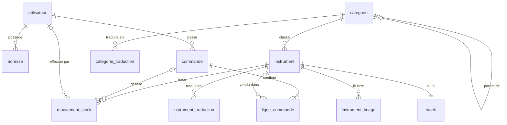
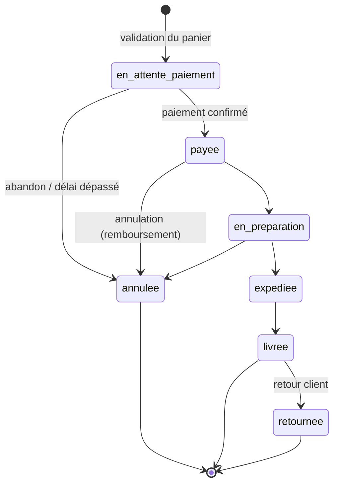

# Schéma de la base de données

> MariaDB 11.4 — `utf8mb4_unicode_ci` — moteur InnoDB — Doctrine ORM (attributs PHP 8)
> Statut : **v1 implémentée** (2026-09-29) — entités dans `src/Entity/`, migration `Version20260929070057`.

## Principes

| Règle | Choix |
|---|---|
| Nommage | tables et colonnes en `snake_case`, singulier (`instrument`, `ligne_commande`) |
| Clés primaires | `id INT UNSIGNED AUTO_INCREMENT` |
| Montants | **entiers en centimes** (`INT`), jamais de `FLOAT` — ex. 149,90 € → `14990` |
| Devise | EUR uniquement (v1) |
| TVA | taux en points de base (`2100` = 21 %) stocké sur l'instrument et **recopié** sur la ligne de commande |
| Dates | `DATETIME` en UTC (`*_at`), type Doctrine `datetime_immutable` |
| Énumérations | `VARCHAR` + PHP `enum` backed (`src/Enum/`), pas d'`ENUM` SQL (migrations plus simples) |
| Multilingue | contenus traduisibles dans des tables `*_traduction` (une ligne par `locale` : `fr`, `en`, `es`…) |
| Historique | une commande **fige** les données au moment de l'achat (adresses, libellés, prix) |
| Booléens | colonne SQL `is_xxx`, propriété PHP `xxx` + méthode `isXxx()` (champ API : `published`, `active`…) |
| Contraintes `CHECK` | ajoutées à la main dans la migration (non générées par Doctrine) |

## Diagramme

## Tables

### Clients et comptes

#### `utilisateur`
Compte client ou administrateur (implémente `UserInterface`).

| Colonne | Type | Contraintes | Note |
|---|---|---|---|
| id | INT UNSIGNED | PK | |
| email | VARCHAR(180) | NOT NULL, **UNIQUE** | identifiant de connexion |
| password | VARCHAR(255) | NOT NULL | hash (algorithme `auto`) |
| roles | JSON | NOT NULL | `["ROLE_USER"]`, `["ROLE_ADMIN"]` |
| prenom | VARCHAR(100) | NOT NULL | |
| nom | VARCHAR(100) | NOT NULL | |
| telephone | VARCHAR(30) | NULL | |
| locale | VARCHAR(5) | NOT NULL, défaut `fr` | langue des e-mails |
| is_verified | TINYINT(1) | NOT NULL, défaut 0 | e-mail confirmé |
| created_at | DATETIME | NOT NULL | |
| updated_at | DATETIME | NOT NULL | |

#### `adresse`
Carnet d'adresses du client.

| Colonne | Type | Contraintes | Note |
|---|---|---|---|
| id | INT UNSIGNED | PK | |
| utilisateur_id | INT UNSIGNED | FK → utilisateur, **ON DELETE CASCADE** | |
| libelle | VARCHAR(50) | NULL | « Maison », « Atelier »… |
| prenom, nom | VARCHAR(100) | NOT NULL | destinataire |
| societe | VARCHAR(150) | NULL | |
| rue | VARCHAR(255) | NOT NULL | |
| complement | VARCHAR(255) | NULL | |
| code_postal | VARCHAR(20) | NOT NULL | |
| ville | VARCHAR(100) | NOT NULL | |
| pays | CHAR(2) | NOT NULL | ISO 3166-1 (`BE`, `FR`…) |
| is_default | TINYINT(1) | NOT NULL, défaut 0 | |

### Catalogue

#### `categorie`
Arborescence (ex. *Cordes › Cordes pincées › Luths*).

| Colonne | Type | Contraintes | Note |
|---|---|---|---|
| id | INT UNSIGNED | PK | |
| parent_id | INT UNSIGNED | FK → categorie, NULL, **ON DELETE RESTRICT** | racine si NULL |
| position | SMALLINT | NOT NULL, défaut 0 | ordre d'affichage |
| is_active | TINYINT(1) | NOT NULL, défaut 1 | |

#### `categorie_traduction`

| Colonne | Type | Contraintes |
|---|---|---|
| id | INT UNSIGNED | PK |
| categorie_id | INT UNSIGNED | FK → categorie, ON DELETE CASCADE |
| locale | VARCHAR(5) | NOT NULL |
| nom | VARCHAR(100) | NOT NULL |
| slug | VARCHAR(120) | NOT NULL |
| description | TEXT | NULL |

Index uniques : `(categorie_id, locale)`, `(locale, slug)`.

#### `instrument`
Données non traduisibles de l'instrument.

| Colonne | Type | Contraintes | Note |
|---|---|---|---|
| id | INT UNSIGNED | PK | |
| categorie_id | INT UNSIGNED | FK → categorie, NOT NULL, **ON DELETE RESTRICT** | |
| reference | VARCHAR(30) | NOT NULL, **UNIQUE** | SKU interne, ex. `CRD-OUD-0042` |
| pays_origine | CHAR(2) | NULL | ISO 3166-1 |
| region_origine | VARCHAR(100) | NULL | ex. « Anatolie », « Bretagne » |
| facteur | VARCHAR(150) | NULL | luthier / atelier |
| annee_fabrication | SMALLINT | NULL | approximative pour les pièces anciennes |
| etat | VARCHAR(20) | NOT NULL | enum `EtatInstrument` : `neuf`, `occasion`, `ancien`, `restaure` |
| is_piece_unique | TINYINT(1) | NOT NULL, défaut 0 | pièce de collection (stock max 1) |
| prix_ht | INT UNSIGNED | NOT NULL | centimes |
| taux_tva | SMALLINT UNSIGNED | NOT NULL, défaut 2100 | points de base |
| poids_grammes | INT UNSIGNED | NULL | calcul des frais de port |
| dimensions | VARCHAR(100) | NULL | texte libre, ex. `78 × 36 × 18 cm` |
| is_published | TINYINT(1) | NOT NULL, défaut 0 | visible sur le site |
| created_at, updated_at | DATETIME | NOT NULL | |

Index : `(is_published, categorie_id)`, `pays_origine`.

#### `instrument_traduction`

| Colonne | Type | Contraintes |
|---|---|---|
| id | INT UNSIGNED | PK |
| instrument_id | INT UNSIGNED | FK → instrument, ON DELETE CASCADE |
| locale | VARCHAR(5) | NOT NULL |
| nom | VARCHAR(150) | NOT NULL |
| slug | VARCHAR(170) | NOT NULL |
| description_courte | VARCHAR(300) | NULL |
| description | TEXT | NULL |
| materiaux | VARCHAR(255) | NULL |
| histoire | TEXT | NULL |

Index uniques : `(instrument_id, locale)`, `(locale, slug)`.

`histoire` porte le contexte culturel de l'instrument, qui intéresse ce public.

#### `instrument_image`

| Colonne | Type | Contraintes | Note |
|---|---|---|---|
| id | INT UNSIGNED | PK | |
| instrument_id | INT UNSIGNED | FK → instrument, ON DELETE CASCADE | |
| fichier | VARCHAR(255) | NOT NULL | chemin relatif sous `public/uploads/instruments/` |
| alt | VARCHAR(255) | NULL | texte alternatif (accessibilité) |
| position | SMALLINT | NOT NULL, défaut 0 | 0 = image principale |

### Stocks

#### `stock`
État courant, **un seul enregistrement par instrument**.

| Colonne | Type | Contraintes | Note |
|---|---|---|---|
| id | INT UNSIGNED | PK | |
| instrument_id | INT UNSIGNED | FK → instrument, **UNIQUE**, ON DELETE CASCADE | |
| quantite | INT | NOT NULL, défaut 0 | physiquement en stock |
| quantite_reservee | INT | NOT NULL, défaut 0 | bloquée par des commandes non expédiées |
| seuil_alerte | INT | NOT NULL, défaut 1 | notification admin si disponible ≤ seuil |
| emplacement | VARCHAR(50) | NULL | ex. `Réserve A-3` |
| version | INT | NOT NULL, défaut 1 | **verrou optimiste** Doctrine (`#[Version]`) |
| updated_at | DATETIME | NOT NULL | |

Contraintes `CHECK` : `quantite >= 0`, `quantite_reservee >= 0`, `quantite_reservee <= quantite`.
Quantité disponible à la vente = `quantite - quantite_reservee` (calculée, non stockée).

#### `mouvement_stock`
Journal **immuable** de toutes les variations (audit, inventaire).

| Colonne | Type | Contraintes | Note |
|---|---|---|---|
| id | INT UNSIGNED | PK | |
| instrument_id | INT UNSIGNED | FK → instrument, **ON DELETE RESTRICT** | |
| type | VARCHAR(20) | NOT NULL | enum `TypeMouvementStock` |
| quantite | INT | NOT NULL | signée : `+` entrée, `-` sortie |
| commande_id | INT UNSIGNED | FK → commande, NULL, ON DELETE SET NULL | si lié à une vente |
| utilisateur_id | INT UNSIGNED | FK → utilisateur, NULL, ON DELETE SET NULL | auteur (admin) |
| commentaire | VARCHAR(255) | NULL | |
| created_at | DATETIME | NOT NULL | |

Types : `entree` (réception), `reservation`, `liberation` (annulation), `sortie` (expédition), `ajustement` (inventaire, casse), `retour`.
Index : `(instrument_id, created_at)`.

### Commandes

#### `commande`

| Colonne | Type | Contraintes | Note |
|---|---|---|---|
| id | INT UNSIGNED | PK | |
| numero | VARCHAR(20) | NOT NULL, **UNIQUE** | ex. `CMD-2026-000123` |
| utilisateur_id | INT UNSIGNED | FK → utilisateur, NOT NULL, **ON DELETE RESTRICT** | obligations comptables |
| statut | VARCHAR(30) | NOT NULL | enum `StatutCommande` |
| adresse_livraison | JSON | NOT NULL | **copie figée** de l'adresse |
| adresse_facturation | JSON | NOT NULL | copie figée |
| total_ht | INT UNSIGNED | NOT NULL | centimes, somme des lignes |
| total_tva | INT UNSIGNED | NOT NULL | centimes |
| frais_port_ttc | INT UNSIGNED | NOT NULL, défaut 0 | centimes |
| total_ttc | INT UNSIGNED | NOT NULL | centimes, frais de port inclus |
| locale | VARCHAR(5) | NOT NULL | langue du client lors de la commande |
| commentaire_client | TEXT | NULL | |
| numero_suivi | VARCHAR(100) | NULL | transporteur |
| created_at | DATETIME | NOT NULL | |
| paid_at, shipped_at, delivered_at, cancelled_at | DATETIME | NULL | horodatage des étapes |

Index : `(utilisateur_id, created_at)`, `(statut, created_at)`.

#### `ligne_commande`
Chaque ligne **recopie** libellé, référence et prix : une modification ou suppression d'instrument ne change pas les commandes passées.

| Colonne | Type | Contraintes | Note |
|---|---|---|---|
| id | INT UNSIGNED | PK | |
| commande_id | INT UNSIGNED | FK → commande, ON DELETE CASCADE | |
| instrument_id | INT UNSIGNED | FK → instrument, NULL, **ON DELETE SET NULL** | |
| reference | VARCHAR(30) | NOT NULL | copie |
| libelle | VARCHAR(150) | NOT NULL | copie du nom dans la locale de la commande |
| prix_unitaire_ht | INT UNSIGNED | NOT NULL | copie, centimes |
| taux_tva | SMALLINT UNSIGNED | NOT NULL | copie |
| quantite | SMALLINT UNSIGNED | NOT NULL | `CHECK (quantite > 0)` |
| total_ht | INT UNSIGNED | NOT NULL | `prix_unitaire_ht × quantite` |

## Cycle de vie d'une commande et effets sur le stock

| Transition | Effet sur `stock` | `mouvement_stock` |
|---|---|---|
| → `en_attente_paiement` | `quantite_reservee += n` | `reservation` |
| → `annulee` (avant expédition) | `quantite_reservee -= n` | `liberation` |
| → `expediee` | `quantite -= n`, `quantite_reservee -= n` | `sortie` |
| → `retournee` | `quantite += n` (si revendable) | `retour` |

Règles :
- Les transitions passent par **Symfony Workflow** (`config/packages/workflow.yaml`), jamais par une modification directe du statut.
- Toute écriture sur `stock` se fait dans **une transaction** avec le verrou optimiste, et crée le `mouvement_stock` correspondant. Le panier est vérifié contre la quantité disponible lors de la validation.
- Commandes `en_attente_paiement` non payées : libérées automatiquement après **30 min** (commande Messenger planifiée).

## Hors périmètre v1 (évolutions prévues)

- **Panier** : côté client (React, `localStorage`), il n'est persisté qu'à la validation. Une table `panier` pourra être ajoutée pour le multi-appareils.
- **Paiement** : une table `paiement` (prestataire, identifiant de transaction, montant, statut) sera ajoutée avec le choix du prestataire (Mollie ou Stripe).
- **Factures** : table `facture` avec une numérotation légale continue.
- **Codes promo**, **avis clients**, **liste de souhaits**, **frais de port par zone**.

## Exposition via l'API (API Platform)

État v1 : seuls **`/api/categories`** et **`/api/instruments`** sont exposés (formats JSON et JSON-LD).
Le filtrage public (instruments publiés, catégories actives) est fait par `src/Doctrine/CatalogueVisibleExtension.php`.
Les autres ressources seront exposées avec les voters et le Workflow de commande.

| Ressource | Lecture | Écriture |
|---|---|---|
| Catégories, instruments publiés, images | public | `ROLE_ADMIN` |
| Stock (disponibilité) | public : champ calculé `disponible` uniquement | `ROLE_ADMIN` |
| Mouvements de stock | `ROLE_ADMIN` | `ROLE_ADMIN` (création seule) |
| Commandes, lignes | propriétaire (voter) ou `ROLE_ADMIN` | création : client connecté ; statut : `ROLE_ADMIN` via Workflow |
| Utilisateur, adresses | propriétaire (voter) | propriétaire |

Les entités ne sont pas exposées directement : les lectures publiques passent par des **DTO / groupes de sérialisation**, pour ne jamais exposer l'emplacement en réserve, les quantités exactes, le `password` ou les `roles`.
