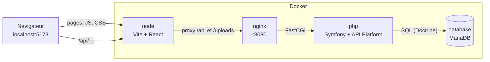
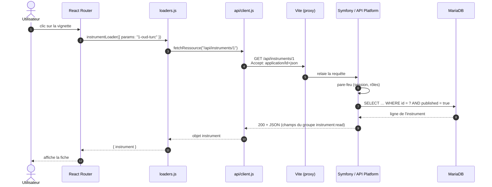

# Comment React interroge l'API, et comment l'API est sécurisée

## 1. Vue d'ensemble

En développement, cinq conteneurs Docker travaillent ensemble. Le navigateur ne parle **qu'à Vite** (port 5173). Vite sert l'application React et relaie tout ce qui commence par `/api` vers Symfony.



Pour le navigateur, React et l'API sont donc sur la **même origine** (`localhost:5173`). Cela a deux conséquences :

- pas de problème de CORS, puisque le navigateur ne voit jamais un autre domaine ;
- le futur cookie de session sera envoyé automatiquement avec chaque appel à l'API.

Le relais est configuré dans `frontend/vite.config.js` :

```js
proxy: {
  '/api': { target: 'http://nginx:80', changeOrigin: true },
  '/uploads': { target: 'http://nginx:80', changeOrigin: true },
},
```

## 2. Le trajet d'une requête, étape par étape

Exemple : l'utilisateur clique sur la vignette « Oud turc ».



### Côté React : trois couches

| Fichier | Rôle |
|---|---|
| `src/router.jsx` | Associe chaque URL à une page et à un *loader* |
| `src/loaders.js` | Charge les données **avant** d'afficher la page |
| `src/api/client.js` | Seul endroit qui appelle `fetch()` : en-têtes, cookies, erreurs, pagination |

Le client (`src/api/client.js`) :

```js
const reponse = await fetch(url, {
  headers: { Accept: 'application/ld+json' }, // format Hydra : contient la pagination
  credentials: 'same-origin',                 // envoie le cookie de session
  signal,                                     // annule la requête si l'utilisateur change de page
})

if (!reponse.ok) {
  throw data(null, { status: reponse.status }) // 404 → page « introuvable »
}
```

`fetchCollection()` suit la pagination : l'API renvoie 24 instruments par page, avec un lien `view.next` vers la suivante. Le client boucle jusqu'à la dernière page.

### Côté Symfony : ce qui se passe à l'arrivée

1. **nginx** transmet la requête à PHP-FPM (`public/index.php`).
2. Le **routeur** reconnaît `/api/instruments/{id}`, une route générée par API Platform à partir de l'attribut `#[ApiResource]` de `src/Entity/Instrument.php`.
3. Le **pare-feu Symfony Security** identifie l'utilisateur (anonyme pour l'instant) et vérifie la règle `security` de l'opération.
4. Le **provider Doctrine** d'API Platform construit la requête SQL. L'**extension** `src/Doctrine/CatalogueVisibleExtension.php` y ajoute `published = true`.
5. Le **sérialiseur** transforme l'entité en JSON, en ne gardant que les champs du groupe `instrument:read`.

## 3. Comment l'API est sécurisée

### Ce qui est en place

| Protection | Où | Effet |
|---|---|---|
| **Droits par opération** | `security: "is_granted('ROLE_ADMIN')"` dans `Instrument.php` et `Categorie.php` | Lecture publique ; `POST`, `PATCH` et `DELETE` réservés aux administrateurs. Un anonyme reçoit `401`. |
| **Filtrage des données visibles** | `src/Doctrine/CatalogueVisibleExtension.php` | Un visiteur ne voit que les instruments publiés et les catégories actives, y compris en devinant un identifiant (un brouillon renvoie `404`). |
| **Liste blanche des champs** | Groupes de sérialisation `#[Groups(['instrument:read'])]` | Seuls les champs explicitement marqués sortent. Le stock physique, l'emplacement en réserve, les mots de passe et les rôles ne sont jamais envoyés. |
| **Liste blanche en écriture** | Groupe `instrument:write` | Un client ne peut pas modifier `id`, `prixTtc` ou `disponible`, même s'il les envoie. |
| **Ressources non exposées** | `Utilisateur`, `Adresse`, `Commande`, `Stock`, `MouvementStock` n'ont pas d'`#[ApiResource]` | Aucune route n'existe pour elles pour l'instant. |
| **Validation** | Contraintes `#[Assert\…]` sur les entités | Données invalides refusées avec `422` et le détail des erreurs. |
| **Intégrité en base** | Contraintes `CHECK`, clés étrangères, verrou optimiste sur `stock` | Même un bug applicatif ne peut pas rendre un stock négatif. |
| **Injection SQL** | Doctrine utilise des requêtes préparées | Les valeurs envoyées ne sont jamais concaténées dans le SQL. |
| **Mots de passe** | Hachage `auto` (bcrypt ou argon2), hash retiré de la session | Jamais stockés en clair. |
| **CORS** | `config/packages/nelmio_cors.yaml` + `CORS_ALLOW_ORIGIN` | Seules les origines `localhost` et `127.0.0.1` sont autorisées en dev. |

Exemple vérifié :

```text
GET    /api/instruments/1   → 200  (publié)
GET    /api/instruments/7   → 404  (brouillon : invisible pour un visiteur)
POST   /api/instruments     → 401  « Access Denied. The user doesn't have ROLE_ADMIN. »
DELETE /api/instruments/1   → 401
```

### Ce qui manque encore

| Manque | Conséquence actuelle | Solution prévue |
|---|---|---|
| **Aucune route de connexion** | Personne ne peut obtenir `ROLE_ADMIN` via l'API, donc toute écriture est impossible. C'est sûr, mais inutilisable pour l'administration. | `json_login` sur `/api/login`, `/api/logout` et `/api/me` (voir document 02) |
| **Voters personnalisés** | Pas encore nécessaires : seul le catalogue public est exposé | `CommandeVoter` : un client ne voit que ses propres commandes |
| **Protection CSRF** | Pas de risque tant qu'il n'y a pas de connexion | Cookie `SameSite=Lax`, JSON obligatoire en écriture ; jeton CSRF à évaluer |
| **Limitation de débit** | La connexion pourra être attaquée par force brute | `login_throttling` de Symfony |
| **CORS en production** | La valeur actuelle n'autorise que `localhost` | Mettre le vrai domaine dans `CORS_ALLOW_ORIGIN`, ou tout servir sur un seul domaine |
| **Traces d'erreur** | En dev, les erreurs contiennent la pile d'appels (fichiers, lignes) | Automatique avec `APP_ENV=prod` : message générique seulement |
| **HTTPS** | En dev, tout passe en HTTP | Certificat Let's Encrypt via Plesk, cookies `secure` |

### Le choix du cookie de session plutôt qu'un jeton JWT

React est servi sur le même domaine que l'API. Le mode le plus simple et le plus sûr est donc le **cookie de session Symfony** :

- le cookie est `HttpOnly` : JavaScript ne peut pas le lire, donc une faille XSS ne permet pas de le voler ;
- rien à stocker dans `localStorage`, rien à rafraîchir ;
- la déconnexion est immédiate côté serveur.

Un jeton JWT ne deviendrait utile que si une application mobile ou un autre domaine devait appeler l'API. C'est pourquoi `config/packages/api_platform.yaml` contient `stateless: false`.
