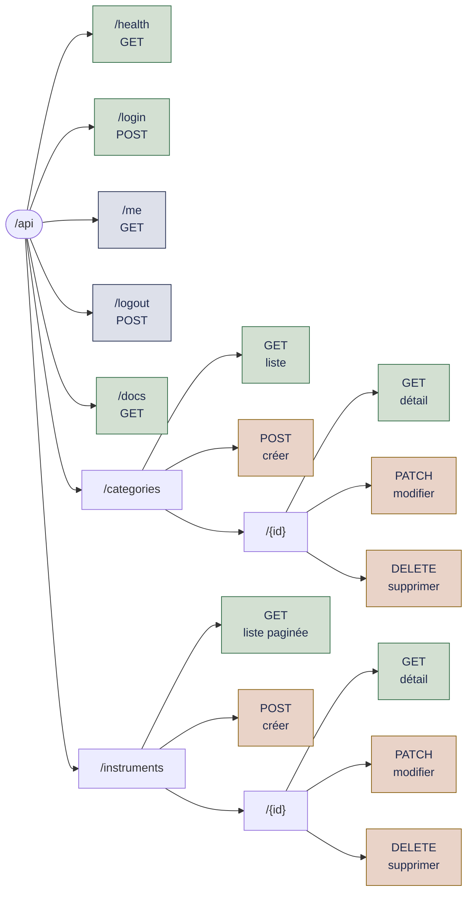
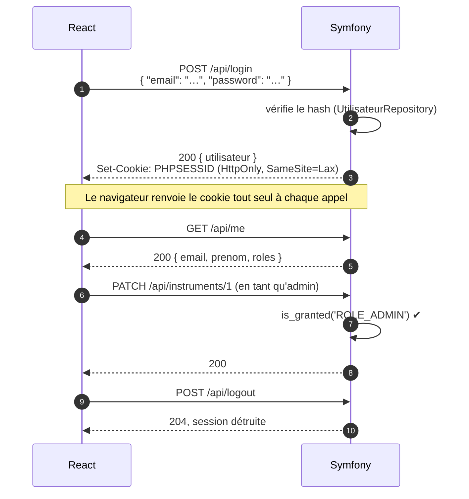

# Carte des chemins de l'API et connexion depuis React

## 1. Tous les chemins existants

Liste obtenue avec `docker compose exec php php bin/console debug:router`.



Vert : public. Gris-bleu : nécessite une session. Brun : réservé à `ROLE_ADMIN`.

### Détail

| Méthode | Chemin | Accès | Réponse | Utilisé par React |
|---|---|---|---|---|
| `GET` | `/api/health` | public | `{"status":"ok","database":"ok"}` | non (supervision) |
| `GET` | `/api/docs` | public | documentation interactive (Swagger UI) | non |
| `POST` | `/api/login` | public | `{"email","password"}` → `200` + utilisateur + cookie ; `401` si refusé | **oui**, page `/connexion` |
| `GET` | `/api/me` | session | utilisateur connecté, ou `401` | **oui**, à chaque navigation (en-tête) |
| `POST` | `/api/logout` | session | `204`, session détruite | **oui**, bouton « Se déconnecter » |
| `GET` | `/api/categories` | public | catégories **actives**, triées par position, sans pagination | non (plus nécessaire) |
| `GET` | `/api/categories/{id}` | public | une catégorie active | non |
| `POST` | `/api/categories` | admin | crée une catégorie | pas encore |
| `PATCH` | `/api/categories/{id}` | admin | modifie une catégorie | pas encore |
| `DELETE` | `/api/categories/{id}` | admin | supprime une catégorie ; bloqué par la base (`RESTRICT`) si elle contient des instruments, avec une erreur `500` à remplacer par un message clair | pas encore |
| `GET` | `/api/instruments` | public | instruments **publiés** (tous pour un admin), 24 par page, les plus récents d'abord | **oui**, page d'accueil |
| `GET` | `/api/instruments/{id}` | public | un instrument publié (ou brouillon pour un admin), sinon `404` | **oui**, fiche instrument |
| `POST` | `/api/instruments` | admin | crée un instrument, son stock est créé automatiquement | pas encore |
| `PATCH` | `/api/instruments/{id}` | admin | modifie un instrument | pas encore |
| `DELETE` | `/api/instruments/{id}` | admin | supprime un instrument | pas encore |

Chemins techniques générés par API Platform, que l'on n'appelle pas directement :
`/api` (point d'entrée Hydra), `/api/contexts/{nom}` (contextes JSON-LD), `/api/errors/{code}`, `/api/validation_errors/{id}`.

### Formats de réponse

Le format est choisi par l'en-tête `Accept` :

| `Accept` | Format | Quand l'utiliser |
|---|---|---|
| `application/json` | JSON simple : tableau d'objets, sans pagination | tests rapides |
| `application/ld+json` | JSON-LD / Hydra : objets dans `member`, avec `totalItems` et `view.next` | **React** (pagination) |

En écriture : `Content-Type: application/ld+json` (ou `application/json`) pour `POST`, et `application/merge-patch+json` pour `PATCH`.

### Exemple de réponse : `GET /api/instruments/1`

```json
{
  "id": 1,
  "reference": "CRD-OUD-0001",
  "categorie": {
    "id": 2,
    "traductions": { "fr": { "nom": "Cordes pincées", "slug": "cordes-pincees" } },
    "parent": { "id": 1, "traductions": { "fr": { "nom": "Cordes", "slug": "cordes" } } }
  },
  "paysOrigine": "TR",
  "regionOrigine": "Anatolie",
  "etat": "neuf",
  "pieceUnique": false,
  "published": true,
  "prixHt": 89000,
  "tauxTva": 2100,
  "prixTtc": 107690,
  "disponible": 3,
  "traductions": {
    "fr": { "nom": "Oud turc", "slug": "oud-turc", "descriptionCourte": "…", "histoire": "…" },
    "en": { "nom": "Turkish oud", "slug": "turkish-oud" }
  },
  "images": []
}
```

Conventions à connaître :

- **Montants en centimes** : `107690` vaut 1 076,90 €. React formate avec `formaterPrix()`.
- **TVA en points de base** : `2100` vaut 21 %.
- **Traductions indexées par langue** : `traductions.fr.nom`. React utilise `traduction(objet, 'fr')`, avec repli sur le français.
- **`disponible`** : stock moins les réservations, seule donnée de stock publique.

## 2. Se connecter à l'API depuis React

### Lire des données publiques (en place)

Tout passe par `src/api/client.js`. Pour ajouter une nouvelle page, on écrit un loader :

```js
// src/loaders.js
export async function categoriesLoader({ request }) {
  return { categories: await fetchCollection('/api/categories', request.signal) }
}
```

puis on le déclare dans `src/router.jsx`, et on lit les données dans la page avec `useLoaderData()`.

Tester l'API sans React :

```bash
curl -H 'Accept: application/json' http://localhost:8080/api/instruments
curl -H 'Accept: application/json' http://localhost:5173/api/instruments/1   # via le proxy Vite
```

Ou ouvrir **http://localhost:8080/api/docs** : chaque route peut être essayée depuis le navigateur.

### S'authentifier (en place)

Connexion par cookie de session (le choix est expliqué dans le document 01) :



Côté React, il n'y a **aucun jeton à stocker** : le navigateur gère le cookie. Tout passe par le routeur :

| Élément | Fichier | Rôle |
|---|---|---|
| `racineLoader` | `src/loaders.js` | Appelle `/api/me` à chaque navigation ; `null` si anonyme |
| `useRouteLoaderData('racine')` | `src/components/Layout.jsx` | Lit l'utilisateur pour l'en-tête (« Se connecter » ou nom + « Se déconnecter ») |
| `connexionAction` | `src/loaders.js` | Reçoit le formulaire, appelle `POST /api/login`, puis redirige vers `?retour=` |
| `deconnexionAction` | `src/loaders.js` | Appelle `POST /api/logout`, puis redirige vers l'accueil |
| Page `/connexion` | `src/pages/Connexion.jsx` | Formulaire `<Form method="post">`, message d'erreur, état « Connexion en cours… » |

```js
// src/loaders.js (extrait)
export async function connexionAction({ request }) {
  const formulaire = await request.formData()
  const reponse = await envoyerJson('/api/login', {
    corps: { email: formulaire.get('email'), password: formulaire.get('password') },
  })
  if (reponse.ok) return redirect(cheminDeRetour(request.url))
  return { erreur: reponse.corps?.error ?? 'Adresse e-mail ou mot de passe incorrect.' }
}
```

Après chaque action, React Router relance les loaders : l'en-tête et le catalogue se mettent à jour seuls. Un administrateur connecté voit en plus les brouillons, marqués « Non publié ».

Tester avec `curl` :

```bash
curl -c cookies.txt -H 'Content-Type: application/json' \
     -d '{"email":"admin@instruments.test","password":"admin"}' http://localhost:8080/api/login
curl -b cookies.txt http://localhost:8080/api/me
curl -b cookies.txt -X POST http://localhost:8080/api/logout
```

Comptes de test (créés par `make fixtures`) : `admin@instruments.test` / `admin`, et les clients avec le mot de passe `client` (voir `README.md`).

Chemins encore à venir : `POST /api/utilisateurs` (inscription), `GET`/`POST /api/commandes` (commandes du client connecté, avec voter).
