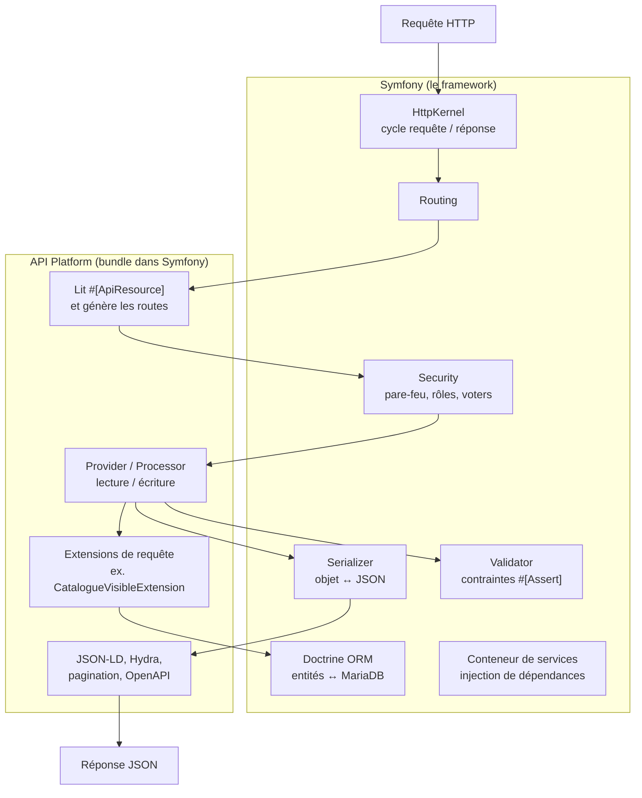

# À quoi sert Symfony si on utilise API Platform ?

## La réponse courte

**API Platform n'est pas une alternative à Symfony : c'est un bundle qui tourne dans Symfony.**
Sans Symfony, API Platform ne peut pas fonctionner : il s'appuie sur ses composants pour chaque requête.

On peut le comparer à une maison : Symfony est la structure (fondations, murs, électricité), API Platform est une cuisine équipée installée dedans. La cuisine fait gagner beaucoup de temps, mais elle a besoin des murs et du courant.

## Qui fait quoi pendant une requête

Exemple avec `GET /api/instruments/1` :



| Besoin | Fourni par |
|---|---|
| Recevoir la requête, produire la réponse | Symfony HttpKernel |
| Créer `/api/instruments` et ses 5 opérations **sans écrire de contrôleur** | API Platform |
| Vérifier que l'utilisateur est administrateur | Symfony Security (API Platform ne fait que lire la règle `security: …`) |
| Lire et écrire en base | Doctrine (intégré à Symfony) |
| Choisir les champs envoyés au client | Symfony Serializer + groupes |
| Pagination, format Hydra, documentation `/api/docs` | API Platform |
| Valider les données reçues | Symfony Validator |
| Tout relier (injection de dépendances, configuration, cache, environnements) | Symfony |

## Ce qu'API Platform nous évite d'écrire

Pour `Instrument`, ces quelques lignes remplacent un contrôleur complet :

```php
#[ApiResource(
    operations: [
        new GetCollection(),
        new Get(),
        new Post(security: "is_granted('ROLE_ADMIN')"),
        new Patch(security: "is_granted('ROLE_ADMIN')"),
        new Delete(security: "is_granted('ROLE_ADMIN')"),
    ],
    normalizationContext: ['groups' => ['instrument:read']],
    denormalizationContext: ['groups' => ['instrument:write']],
    paginationItemsPerPage: 24,
)]
class Instrument
```

Sans API Platform, il faudrait écrire à la main un `InstrumentController` avec 5 méthodes : lire les paramètres, charger l'entité, vérifier les droits, désérialiser et valider le JSON, gérer les erreurs 400, 404 et 422, paginer, sérialiser, et documenter l'API.

## Ce qu'API Platform ne fait pas, et que Symfony assure dans ce projet

Un site de vente d'instruments ne se limite pas à exposer des tables en JSON. Le métier réel passe par Symfony :

| Besoin du projet | Outil Symfony | Exemple |
|---|---|---|
| Connexion et sessions des clients | **Security** (`json_login`, voters) | `/api/login`, `CommandeVoter` |
| Cycle de vie d'une commande | **Workflow** | en attente → payée → expédiée → livrée, transitions contrôlées |
| Réserver, sortir ou libérer le stock | **Services** métier (`src/Service/`) | transaction + `MouvementStock` + verrou optimiste |
| E-mails de confirmation de commande | **Mailer** + Twig | visibles dans Mailpit en dev |
| Annuler les commandes non payées après 30 min | **Messenger** + **Scheduler** | tâche planifiée |
| Traductions fr, en, es des e-mails et messages | **Translation** | fichiers `translations/` |
| Base de données et évolutions du schéma | **Doctrine** + **Migrations** | `migrations/Version…php` |
| Données de développement | **DoctrineFixturesBundle** | `make fixtures` |
| Commandes d'administration | **Console** | `bin/console app:import-catalogue` |
| Pages serveur si besoin (SEO, back-office) | **Twig** | rendu HTML côté serveur |
| Tests automatisés | **PHPUnit** + `WebTestCase` | tester `/api/instruments` |

Même dans API Platform, les cas particuliers se codent **en Symfony** : un *State Processor* pour créer une commande (vérifier le stock, figer les prix, réserver) est un service Symfony ordinaire, injecté par le conteneur.

## En résumé

- **Symfony** est le socle : requêtes, sécurité, base de données, e-mails, tâches planifiées, configuration, tests.
- **API Platform** est un accélérateur dans ce socle : il transforme des entités annotées en API REST documentée, et évite des centaines de lignes de contrôleurs répétitifs.
- **React** ne voit que le résultat : une API JSON propre, cohérente et documentée sur `/api/docs`.

On garde ainsi le meilleur des deux : la productivité d'API Platform pour le CRUD, et toute la puissance de Symfony pour la logique métier (stocks, commandes, paiements).
